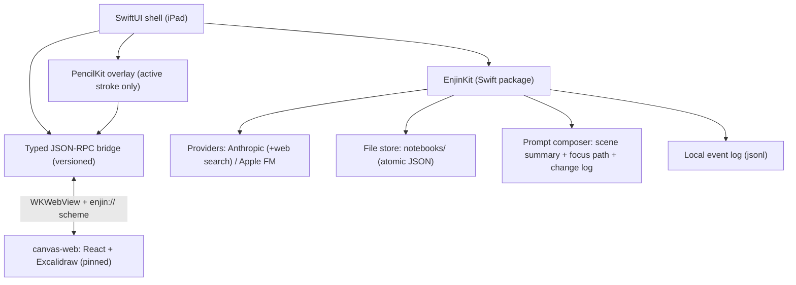

# Enjin v0.1 — Technical Plan (rev 2)

> Scope: iPad only. Canvas + agent + zoom-dive exploration. One worked example of a real 13-year-old exploring a topic. Anything not listed in scope is out.

## 0. What changed from rev 1, and why

| Change | Reason |
|---|---|
| Zoom-dive is now **portals** (nested sub-scenes), not one infinite canvas | Excalidraw's zoom range (~0.1×–30×) runs out after about 3 nesting levels, and the worked example needs 4. With portals, each scene stays small, which removes the risk of jank as the canvas grows. |
| Cards render as **native Excalidraw elements** tagged with `customData.cardId`, not embeddables | Embeddables are DOM overlays. They don't show up in `exportToBlob` snapshots (so lasso→agent would break), they slow down with many cards, and they are awkward at extreme zoom. Rich detail goes in a native sheet. |
| **Stub cards** + prefetch | An LLM turn can't fit inside a 2s dive. Each filled card comes with 2–3 cheap title-only stubs, and the most likely stub is prefetched. The dive itself is instant and content streams in. |
| Ink spike now tests **handoff and registration**, not raw latency | PencilKit meets <20ms on its own. The real risks are touch routing, flicker on stroke handoff, and coordinate mapping. |
| **Ownership split:** the Excalidraw scene owns geometry, native owns card semantics | Rev 1 had two writers for `bbox` and no place to store ink or arrows. |
| **Plain files on disk** instead of SwiftData | Atomic writes, easy to inspect, notebooks can be exported for debugging, test fixtures are trivial, and fewer moving parts. |
| Web search uses **Anthropic's server-side web search tool** instead of a Brave/Exa key | One key (entered by a parent) instead of two. Citations come back built in, and domain blocking helps keep it kid-safe. |
| The model never picks coordinates. A **layout solver** places cards | LLM-chosen positions overlap and drift. |
| Streaming is required from M2 | Cards have to fill in progressively for the loop to feel alive. |
| Added a **reliability bar**, **local telemetry**, **eval set**, and **dogfood week** | "Stable" needs a definition. The two-week verdict needs data, not impressions. |
| `requestFocus` became `suggestFocus` | The agent doesn't move the kid's viewport while the kid is interacting. |
| Apple FM gets its own small prompt budget | The on-device context is ~4K tokens. |

## 1. Objective and success criteria

v0.1 answers one question: **does the canvas-exploration loop hold a curious 13-year-old's attention?**

Success criteria (two-week test). Each one is measured from local telemetry (§9), not from memory:
- **Cold start:** cold open → a populated canvas on a topic the kid chose in < 10 min, with no instructions. Measured as `first_open → 5th card created`.
- **Dive feel:** the portal transition starts in < 100ms. The first streamed content in a stub appears in < 2s at p50 (< 4s at p90). If the stub was prefetched, content shows immediately.
- **Return:** the kid opens the app unprompted on at least 3 separate days, and shows someone something they made (from observation or the parent's report).
- **Ink:** the native stroke has no perceptible lag, there is no visible flicker when the stroke hands off to the canvas, and strokes stay in place through pan/zoom.

Secondary signals to record (not pass/fail): max dive depth reached, cards the kid created vs. the agent created, agent cards deleted by the kid (a garbage signal), questions asked per session.

**Non-goals** (v1 backlog, do not build): Truth Engine beyond source-conflict display, 3D worlds, atlas, mastery/BKT, quiz generation, voice, classroom/parent dashboards, iPhone/Mac builds, a second search provider, iCloud sync, localization, multiplayer.

## 2. System overview



There are two runtimes with a hard boundary between them:
- **Native** owns device capabilities, provider calls, persistence (the source of truth for everything), prompt composition, telemetry, and the active Pencil stroke.
- **Web** owns rendering and interacting with the *currently open portal's* Excalidraw scene. It holds no state that native can't rebuild. If the WebContent process dies, native reloads the web view and rehydrates it.

## 3. Core interaction model (decide this before writing code)

### 3.1 Notebooks, portals, cards
- A **notebook** is a tree of **portals**. The root portal is the notebook's top-level canvas.
- Every **topic card** can be dived into. Diving opens the card's own portal (a sub-scene). The portal header shows the card's expanded content, and its children are laid out below.
- A notebook's scene is therefore a set of small Excalidraw scenes, one per portal, each typically holding < 60 elements.

### 3.2 Diving
- **Zoom in:** when the kid pinches into a topic card past a threshold (the card covers ≥ 70% of the viewport, or they double-tap it), web runs the portal transition. The current scene scales up and fades, the child scene fades in at its framing viewport, and web sends `portal.entered`.
- **Zoom out:** pinching out past the portal's minimum zoom returns to the parent portal, framed on the card you came from.
- A **native breadcrumb bar** (Roman Empire › Legions › Why Rome won) is always visible. Tapping a crumb jumps there.
- **"See the whole map"** is a native overview: a zoomable tree or mini-map of all portals with card titles. It's read-only in v0.1, and tapping a node navigates there. This covers the worked example's "zoom out and see the whole map" without one huge canvas.
- In the parent scene, cards that have children show a depth badge (e.g. "▸ 4") so the kid can see that there's more inside.

### 3.3 Card states
`stub` (title only, dashed border) → `filling` (streaming, shimmer) → `filled` → (optional) `error` (inline retry).
- Every agent-filled topic card comes with **2–3 stub children**, generated in the same turn. That's cheap, since they're titles plus one-line summaries.
- **Prefetch:** when the kid lingers on a card for > 1.5s, or a card is the most likely next dive, native fills the top stub in the background. At most 1 prefetch is in flight, and prefetch is skipped on Apple FM.
- Diving into a stub starts filling it right away, and the portal opens immediately with the stub's title as its header.

### 3.4 Ownership of state
| Thing | Owner | Stored as |
|---|---|---|
| Geometry of every element (cards, ink, arrows, shapes) | Excalidraw scene | `scenes/<portalId>.json`, written by native from web snapshots |
| Card semantics (title, summary, content, sources, state, parent, provenance) | Native | `cards.json` |
| Link between the two | `element.customData = { cardId, role }` | in the scene |

A card is drawn as a grouped set of Excalidraw primitives: a frame rectangle, a title, a summary, an optional image, and a source chip. When card semantics change, native sends `canvas.applyOps`, and web regenerates that card's primitives in place, keeping its position. When the kid moves or resizes a card, only the scene changes, and native reads bboxes from the scene when it needs them for prompts.

Tapping a card's **"open"** affordance shows a **native sheet** with the full content, the source list with links, and a "where this came from" provenance view. Anything rich (long text, multiple images, citations) lives there and not on the canvas.

## 4. Module breakdown

### 4.1 Native shell (SwiftUI, iPadOS 26+)
- **Views:** notebook list, canvas container (WKWebView + PencilKit overlay + breadcrumb bar + agent dock), map overview, card detail sheet, settings (key entry with parent consent, provider status, daily spend cap, "export debug bundle").
- **Input:** typed text, pasted images, and Pencil ink. Camera/photo is deferred to v0.2.
- **WebView hosting:**
  - Load the bundle through a `WKURLSchemeHandler` on `enjin://`, not `file://`. This avoids CORS and font/worker loading problems. Bundle the Excalidraw fonts and set `EXCALIDRAW_ASSET_PATH`.
  - Handle `webViewWebContentProcessDidTerminate` by reloading and rehydrating the current portal from disk. Treat this as a normal event, not a crash.
  - Disable link navigation out of the web view. External links open in `SFSafariViewController` from the native sheet.

### 4.2 Ink pipeline (the M0 spike)
- A `PKCanvasView` overlay sits above the WKWebView with `drawingPolicy = .pencilOnly`. The overlay's `hitTest` returns `nil` for finger touches, so pan, zoom and taps reach the web view.
- While the pencil is down, web-side panning is locked (`ink.strokeBegan` → web sets `viewModeEnabled`-style lock). Mid-stroke viewport drift is impossible by design.
- When a stroke ends, native sends `ink.commit` with **view-space** points, pressures and timestamps, plus a stroke ID. Web converts to scene coordinates using its own `appState` (web is the only side that knows the viewport exactly), inserts a `freedraw` element (`simulatePressure: false`), and replies `ink.committed {strokeId}` once it has rendered.
- Native keeps the stroke in the PencilKit layer until it receives `ink.committed`, then removes it on the next frame. That way the handoff doesn't flicker.
- Tool picker: pen, highlighter, eraser. The eraser works on Excalidraw elements (via web), not on PencilKit.
- **Fallback (decided in M0):** if the handoff can't be made invisible, or the conversion loses noticeable fidelity, switch to Excalidraw-native freedraw with Pencil pointer events and accept somewhat higher latency.

### 4.3 EnjinKit (Swift package; most logic lives here and is unit-testable without a simulator)
- `Providers/` — `LLMProvider` protocol: `stream(request) -> AsyncThrowingStream<ProviderEvent>`, where events are `textDelta`, `toolUse`, `citation`, `usage` and `stop`.
  - `AnthropicAdapter`: Messages API with streaming, tool use, the **server-side web search tool** (domain blocklist, `max_uses` per turn), and prompt caching on the system prompt + tool definitions. Default model: `claude-sonnet-5-5` at low effort, chosen 2026-10-06 after real-key telemetry (Opus 5.5 was too slow and costly per turn for a kid's pace). Opus 5.5 and Haiku 4.5 remain selectable in Settings. Server-side refusal fallback (`fallbacks: "default"`) is on for Opus/Sonnet. Retries 429/529/5xx with jittered backoff (max 3). Timeout per turn: 45s.
  - `AppleFMAdapter`: on-device Foundation Models, no key. Availability is checked at runtime, since it needs a device that supports Apple Intelligence. It has a reduced tool set and a reduced context (§5.4).
- `Agent/` — the tool loop (§5.3). It's cancellable, has a hard cap on rounds, applies ops transactionally per turn, and has a scripted `FakeProvider` for tests.
- `Prompt/` — the composer (§5). It's a pure function: `(notebook state, focus, input, budget) -> request`. Golden-tested.
- `Layout/` — places new cards in a portal: a ring or grid below the portal header, collision-checked against existing element bboxes, so it never overlaps kid-made content. Deterministic, so it's testable.
- `Store/` — the file store (§6) plus a Keychain wrapper for the key.
- `Telemetry/` — append-only local event log (§9).

### 4.4 canvas-web (TypeScript, Vite, bundled offline)
- React + `@excalidraw/excalidraw` **pinned to an exact version**. Upgrades are deliberate and come with a re-run of the contract tests.
- **Card renderer:** `Card → Excalidraw element group` and back (`cardId` from `customData`). Card elements are styled per state (stub = dashed, filling = animated).
- **Portal service:** loads a scene, runs the dive/exit transitions, frames the viewport, and enforces per-portal zoom limits.
- **Viewport service:** emits `focus.changed` (throttled to 4Hz) with the card nearest the viewport center and the visible card IDs.
- **Change service:** `onChange` → diff by element `version` → debounced `canvas.changed` (500ms) with the changed elements. Native writes the snapshot.
- **Bridge client:** typed `send` and `request` with ID correlation and timeouts.
- **Snapshot service:** `exportToBlob` for a lasso region (used by "ask about this").

### 4.5 Bridge protocol
- **Web→native:** `WKScriptMessageHandlerWithReply`, so requests get real promise-based replies.
- **Native→web:** `callAsyncJavaScript(_:arguments:)`. It passes objects as arguments, which avoids string-escaping bugs and injection.
- **Envelope:** `{v, id, method, params}`. On handshake, a version mismatch shows a hard error screen (this should never ship). Unknown methods return a JSON-RPC error and are logged, never silently dropped.
- **One schema source:** `bridge/schema.ts` (zod). A script generates JSON fixtures for every message, and **both** sides run contract tests against the same fixtures (Vitest on web, XCTest on native, which decodes the fixtures with the Codable types).

**Native → Web:**
- `portal.load {portalId, elements, cards, framing}`: hydrate a scene.
- `canvas.applyOps {turnId, ops[]}`: create/update/delete cards; returns placed bboxes.
- `ink.commit {strokeId, points, pressures, tool}`
- `canvas.flash {cardId}`: highlights a card in response to `suggestFocus`.

**Web → Native:**
- `canvas.ready {protocolVersion, excalidrawVersion}`
- `canvas.changed {portalId, elements[]}` (debounced)
- `focus.changed {portalId, cardId?, zoom, visibleCardIds}`
- `portal.enter {cardId}` / `portal.exit {}`: requests; native decides the target and replies with the scene to load.
- `ink.committed {strokeId}`
- `selection.ask {elementIds, snapshotPNG}`: the "ask about this" lasso.

## 5. Agent design

### 5.1 Persona and output contract
- **Mentor for a curious 13-year-old.** Answer briefly and concretely first, then open doors: every filled card ends with 2–3 stubs ("Zoom in on…"). Ask the kid a question about once every few turns, not every turn. Don't hold answers hostage to "hints first", since that kills curiosity-led exploration.
- Age-appropriate content. Sensitive topics (violence in history, health, self-harm) get calm, factual framing. If something suggests the kid is at risk, step out of the persona and point to a trusted adult or resources.
- Card text limits: title ≤ 60 chars, summary ≤ 140 chars, body ≤ 600 chars. Longer material goes in the detail sheet.

### 5.2 Prompt composition per turn
1. **System** (cached): persona, pedagogy rules, output contract, tool schemas.
2. **Scene summary**, tiered by distance in the portal tree from the current portal:
   - current portal: every card with title + summary + state, plus kid ink/notes as "kid annotated near X";
   - parent and sibling portals: titles;
   - everything else: counts ("Roman army: 14 cards in 3 portals").
3. **Focus path:** portal path from the root plus the focused card.
4. **Change log:** the last ≤ 10 kid-made changes (moved, deleted an agent card, wrote ink, added a note). Older ones fold into the summary.
5. **History:** the current portal's thread (last 8 turns) plus a **global tail** of the last 3 turns from anywhere, so "what about the thing before?" works.
6. **User input:** text, plus an optional lasso snapshot sent **as an image** (Claude reads handwriting directly, so there's no OCR on this path).

Token budget is enforced by the composer: ~12K input on Anthropic, trimming tiers from the outside in. It's golden-tested with a 300-card notebook fixture.

### 5.3 Tools
| Tool | Args | Effect |
|---|---|---|
| `createCards` | `[{type, title, summary, body?, parentCardId, isStub, sourceRefs?}]` (max 4 per call, max 6 per turn) | Native creates the cards, Layout places them, then `canvas.applyOps`. |
| `updateCard` | `{cardId, patch}` | Fills a stub, edits text. Agent-created cards only, unless the kid asked. |
| `suggestFocus` | `{cardId, reason}` | Flashes the card and shows a "go there →" chip. **Never moves the viewport.** |
| `web_search` | server tool | Anthropic-hosted. Results come back with citations and are attached to cards as sources. |
| `note` | `{text}` | Agent scratchpad that's stored on the turn. No canvas effect. |

Positions are never a tool argument.

**Loop:** model turn → tool calls → execute → feed results back, up to **5 rounds** per turn. Each turn has a `turnId`, and every op records `createdByTurnId`.
- **Cancellation:** a new input from the kid cancels the in-flight turn. Cards already applied stay, and stubs that are still `filling` go back to `stub`.
- **Undo:** "Undo last agent turn" (native button) deletes or reverts everything with that `turnId`. Agent ops are applied outside Excalidraw's own undo stack, so the kid's Cmd-Z only touches the kid's own actions.

**Source conflicts:** when search results contradict what the model would have said, or contradict each other, the card says so in plain language ("Sources disagree: …") and cites both. That is the entire v0.1 truth story.

### 5.4 Apple FM (no-key) mode
- The tools are only `createCards` and `updateCard`. Prompt = system (short) + current portal titles + focus card + last 2 turns, fitting in ~3K tokens.
- There's no web search, so cards are marked "unsourced (offline mode)". No prefetch.
- Onboarding is honest about it: "Works without a key, but much better with one."

### 5.5 Errors the kid will see
| Failure | Behavior |
|---|---|
| No network | The card goes to `error` with "Can't reach the internet — try again". Offline mode is offered if Apple FM is available. |
| Invalid or revoked key | A banner for the parent. The kid is never shown a raw API error. |
| Rate limit / overload | Retry silently (max 3), then `error` with retry. |
| Daily spend cap hit | "Enjin is resting for today". Apple FM is offered if available. |
| Bad tool args from the model | Validate, return the error to the model once, then drop the op and log it. |

## 6. Persistence

```
Application Support/Notebooks/<notebookId>/
  notebook.json        // {schemaVersion, title, rootPortalId, createdAt, ...}
  cards.json           // [Card]
  portals.json         // [{portalId, cardId (owner, null for root), parentPortalId}]
  scenes/<portalId>.json   // Excalidraw elements (+ files map for images)
  sessions/<date>.jsonl    // agent turns: inputs, tool calls, results, usage
```
- **Writes:** write to a temp file → `fsync` → atomic rename, through a single serial writer actor. Flush on `scenePhase == .background`.
- **Versioning:** every file carries `schemaVersion`, and migrations run on load. Old versions are backed up before migrating.
- **Card:** `{id, notebookId, portalId, type: topic|source|image|note, title, summary, body, state, sources[], ownsPortalId?, createdBy: kid|agent, createdByTurnId?, createdAt, updatedAt}`.
- **Images:** pasted images are stored as Excalidraw `files` in the scene, downscaled to ≤ 2048px.
- **Debug bundle:** Settings → "Export debug bundle" zips a notebook plus telemetry and shares it via AirDrop. This is how you see what happened during the pilot.

## 7. Safety, privacy, App Review
- **Key and consent:** the parent enters the API key on a consent screen that covers what data goes to Anthropic, the cost, and the spend cap. The key is stored in Keychain (`ThisDeviceOnly`).
- **Web search:** use the domain blocklist (adult and gambling categories, maintained as a short static list) and cap the number of searches per turn.
- **Policy:** before anything beyond a TestFlight pilot with a consenting parent, confirm compliance with Anthropic's usage policy for products used by minors, and add whatever safeguards it requires.
- **Data:** no third-party SDKs and no analytics leave the device. Telemetry is local only and exported by hand.
- **App Store (later):** 13+ rating, AI disclosure, and no-key mode works. Out of scope for the pilot, but don't build anything that blocks it.

## 8. Testing and quality bar

| Layer | Tests |
|---|---|
| EnjinKit | Unit tests: prompt composer golden files (including the 300-card fixture), layout solver properties (no overlaps, deterministic), store round-trips + migrations + crash-mid-write simulation, agent loop against `FakeProvider` scripts (tool errors, cancellation, undo). |
| Bridge | Shared fixture contract tests on both sides (§4.5). |
| canvas-web | Vitest for the card↔element mapping and diffing. Playwright (WebKit) for portal transitions, applyOps placement, and ink commit coordinate conversion at several zoom levels. |
| App | One XCUITest smoke flow on device: onboarding → topic → dive → back → map. |
| Agent quality | **Eval set:** 25 kid-style prompts (including vague ones, sensitive ones, and follow-ups), run against the real model before each TestFlight build. Scored by checklist: ≤ 6 cards, stubs present, sources on factual claims, length limits respected, tone, no unsafe content. Track the score per build. |

**Reliability bar (must pass on a real iPad before the pilot):**
- [ ] Force-quit during an agent turn → reopen → no data loss beyond the in-flight turn, and stubs aren't stuck in `filling`.
- [ ] Kill the WebContent process (debug menu) → the scene recovers in < 2s with no loss.
- [ ] Airplane mode, invalid key, 429 simulation, and spend cap all show the designed errors.
- [ ] A 300-card notebook (20 portals): portal transitions < 100ms to start, panning at 60fps on the pilot device.
- [ ] 30-minute continuous session with no memory growth beyond 100MB over baseline.
- [ ] Zero crashes across the dogfood week.

## 9. Telemetry (local, for the two-week verdict)
Append-only `telemetry.jsonl` events: `app_open`, `session_end{duration}`, `notebook_created`, `card_created{by}`, `card_deleted{by, createdBy}`, `portal_enter{depth}`, `agent_turn{latency_first_token, latency_total, rounds, tokens, cost, error?}`, `ink_stroke`, `ask_about_this`, `undo_agent_turn`, `map_opened`.

There's also a small developer-only stats screen (hidden behind a long-press) that computes the §1 criteria directly.

## 10. Milestones

### M0 — Spike (prove or kill the risky parts) — 2 wks part-time
1. SwiftUI app + offline Excalidraw bundle via `enjin://`, plus the versioned handshake and one round-trip contract test.
2. **Ink:** PencilKit overlay with finger passthrough, pan lock while drawing, `ink.commit` → `ink.committed` handoff. Pass if there's no visible flicker, strokes stay put through pan/zoom at 3 zoom levels, and the stroke shape looks the same as what was drawn. Otherwise use the fallback (§4.2).
3. **Portals:** three nested hard-coded portals with dive/exit transitions and a breadcrumb. Pass if it feels like zooming, not like switching pages (ask one kid to try it).
4. Anthropic adapter: one streamed turn with a custom tool call + web search, printed to a debug view.

**Exit:** a go/no-go note for each spike, written down.

### M1 — Static canvas loop — 3 wks
- File store with atomic writes and migrations. Notebook CRUD.
- Card renderer (all states), manual card creation, card detail sheet.
- Portal tree, breadcrumb, map overview, depth badges.
- Change sync, WebContent crash recovery.
- 300-card / 20-portal performance fixture passes.

### M2 — Agent on canvas — 4 wks
- Prompt composer with tiering + golden tests. Layout solver.
- Tool loop: `createCards`, `updateCard`, `suggestFocus`, streaming fills, cancellation, undo agent turn.
- Stubs + prefetch.
- Error states (§5.5), spend cap, telemetry.
- Apple FM adapter (reduced mode).
- First eval set run.

### M3 — Knowledge + ink questions — 2 wks
- Web search wired in: source cards and source chips, citations in the detail sheet, source-conflict wording.
- Lasso "ask about this" (snapshot → image input).
- Eval set expanded with sourced/conflict cases.

### M4 — Hardening + pilot — 3 wks
- Onboarding: one screen ("What do you want to explore?") → the first topic card with stubs, plus a parent key/consent flow.
- App icon, launch screen, debug bundle export.
- Reliability bar (§8) passes.
- **Dogfood week:** you use it daily for real topics, fix what hurts, and the eval score holds.
- TestFlight to the pilot kid. Two-week test begins. If possible, also run 1–2 short observed sessions with other kids in week one; n=1 is a thin signal.

**Estimate:** about 14 weeks solo part-time (M0 2, M1 3, M2 4, M3 2, M4 3), roughly half that full-time. M2 is the most likely to slip. If it does, cut prefetch and Apple FM before anything else.

## 11. Risks and mitigations

| Risk | Mitigation |
|---|---|
| Ink handoff flickers or misregisters | M0 spike with explicit pass criteria. Fallback to Excalidraw-native ink. |
| Portal transitions feel like page flips, not zooming | M0 spike with a kid. Tune the transition (scale from the card's bbox, crossfade, ≤ 350ms). If it's still bad, cap nesting at 3 and use literal zoom inside one scene. |
| Dives feel slow | Stubs + prefetch + streaming. Haiku for stub generation. Prompt caching. Measured p50/p90 in telemetry. |
| Agent makes garbage or too many cards | Per-turn caps, eval set gate, kid can delete anything, undo agent turn, telemetry on kid-deleted agent cards. |
| Prompt bloat as notebooks grow | Portal-tree tiering from day one, composer budget, 300-card golden test. |
| Excalidraw upgrade breaks things | Pinned version, contract + Playwright tests before any bump. |
| Web process or app crash loses work | Native is the source of truth, atomic writes, crash recovery in the reliability bar. |
| Pedagogy too preachy for the kid | Answer-first persona, questions rationed, eval checks tone. Review the pilot transcripts in the debug bundle. |
| Cost surprises the parent | Daily spend cap, cost shown in settings, Haiku for cheap calls, caching. |
| Apple FM too weak to be useful | It's an explicitly reduced mode. The pilot uses the Anthropic path. |

## 12. Definition of done for v0.1
- M0–M4 complete, and every M0 spike has a written go/no-go.
- The reliability bar (§8) passes on the pilot device.
- The eval set passes at the agreed threshold on the shipped build.
- **Worked example, end to end:** the kid types "Roman Empire" → a topic card with 3 stubs → dives into "Legions" (instant, content streams in) → asks "why did Rome win so much?" → the agent creates sourced child cards (with a source conflict surfaced, if one exists) and flashes a suggested next card → the kid lassos their own sketch and asks about it → the kid zooms back out through the breadcrumb and opens the map to see the whole tree.
- The two-week test verdict is written up from telemetry plus observation. Phase-two decisions are made from that verdict, not before.
